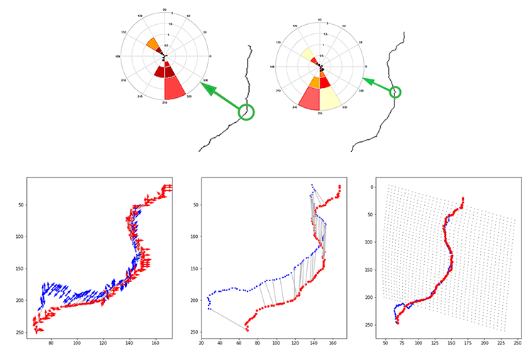

# SkeletonMatching
### Mohammad Mahdi Kamani, Farshid Farhat, Stephen Wistar, James Z. Wang
This repository implements skeleton matching algorithm using Skeleton Context. You can see the demo [here](https://github.com/mmkamani7/SkeletonMatching/blob/master/SkeletonMatching.ipynb). Please cite our papers below if you use our code.



Skeleton of a shape is a low-level representation that can be used for matching and recognition purposes in various fields of study including image retrieval and shape matching or human pose estimation and recovery. Skeleton can provide a good abstraction of a shape, which contains topological structure and its features. Because it is the simplest representation of a shape, there has been an extensive effort among researchers to develop generic algorithms for skeletonization of shapes. However, since there is no “true” skeleton defined for an object, the literature in skeletonization lack of a robust evaluation. The vast majority of the algorithms are based on Blum’s “Grassfire” analogy and formulation for skeletonization. The most important key factor in skeletonization algorithms is to preserve the topology of the shape.

Shape Context as a powerful shape descriptor represents a rough distribution of all other points with respect to a selected point in terms of distance and angle. It has quite number of applications in object recognition, pose recognition, animation construction, to name but a few. Shape context is used to find correspondences between samples from border of two shapes, and then find the cost of matching two shapes using bipartite graph matching. After that, parameters for an affine transform are extracted using thin plate spline ( TPSTPS ), in order to map points from one shape to their correspondences in the other shape with warping the coordinates. Finally, a notion of shape distance for recognition purposes is exploited.

As there are a lot of fluctuations over the boundaries of some shapes in images, these make object matching with boundary samples less effective, and it may result in false matching. On the other hand, matching objects using skeleton samples sounds more robust in the sense that pruned skeleton contains complete shape topology regardless of its boundary variations. Hence, we use shape context to introduce a new descriptor called skeleton context. As it is shown in an example in the figure above, skeleton context is log-polar histogram, formed for each sample point on the skeleton. For more information see the [demo](https://github.com/mmkamani7/SkeletonMatching/blob/master/SkeletonMatching.ipynb).


## Sofrware Requirements
This code has been developed and tested on Python2.7 on Windows, Ubuntu and MacOS, however, it shoud work fine on Python3.x. Please let us know if you have difficulty on running this code on Issues page. The code in Python needs some packages, you can get them by this line of code in bash or cmd (you might need sudo on Linux):

```bash
[sudo] pip install -U scipy scikit-image
```


## Getting Started
You can see the demo in jupyter [here](https://github.com/mmkamani7/SkeletonMatching/blob/master/SkeletonMatching.ipynb) and follow its steps to match images. You can also use the functions directly as it is described in the notebook. Just add these lines at the begining of your code:

```python
import skeletonContext as sc
from skeleton2Graph import skeleton2Graph, mat2gray
```

You can find all the functions needed in two python files provided (``skeletonContext.py`` and ``skeleton2Graph.py``). To find more information about the latter file please see [this repository](https://github.com/mmkamani7/Skeletonization).

## References 
```ref
@article{kamani2017skeleton,
  title={Skeleton Matching with Applications in Severe Weather Detection},
  author={Kamani, Mohammad Mahdi and Farhat, Farshid and Wistar, Stephen and Wang, James Z},
  journal={Applied Soft Computing},
  year={2017},
  publisher={Elsevier}
}
@inproceedings{kamani2016shape,
  title={Shape matching using skeleton context for automated bow echo detection},
  author={Kamani, Mohammad Mahdi and Farhat, Farshid and Wistar, Stephen and Wang, James Z},
  booktitle={Big Data (Big Data), 2016 IEEE International Conference on},
  pages={901--908},
  year={2016},
  organization={IEEE}
}
```
